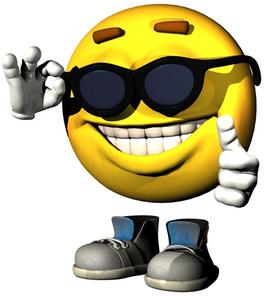

!SLIDE
# Evented Programming with Node.js #
### anders.janmyr@jayway.com
### http://anders.janmyr.com
### @andersjanmyr

!SLIDE
# What?

!SLIDE bullets small
# Node?
* A set of libraries on top of Google V8
* Focused on doing networking right, Async IO
* Using a single thread

!SLIDE

# Evented?

## Asynchronous
## Event Driven
## Callbacks

!SLIDE code
# The Event Loop

    @@@javascript
    while(somethingIsGoingOn()) {
        readyChannels = select(ioChannels);
        for (channel in readyChannels) 
            performIO(channel);
    }

!SLIDE code
# The Real Event Loop

    @@@javascript
    // The Real Event Loop is implicit

!SLIDE center

# Why Node?

!SLIDE center
# Cool

!SLIDE center

# Javascript

.notes Bertrand Russell once gave a public lecture on astronomy. He
described how the earth orbits around the sun and how the sun, in turn,
orbits around the center of a vast collection of stars called our
galaxy. At the end of the lecture, a little old lady at the back of the
room got up and said: "What you have told us is rubbish. The world is
really a flat plate supported on the back of a giant tortoise." The
scientist gave a superior smile before replying, "What is the tortoise
standing on?" "You're very clever, young man, very clever," said the old
lady. "But it's turtles all the way down!"

</img>

