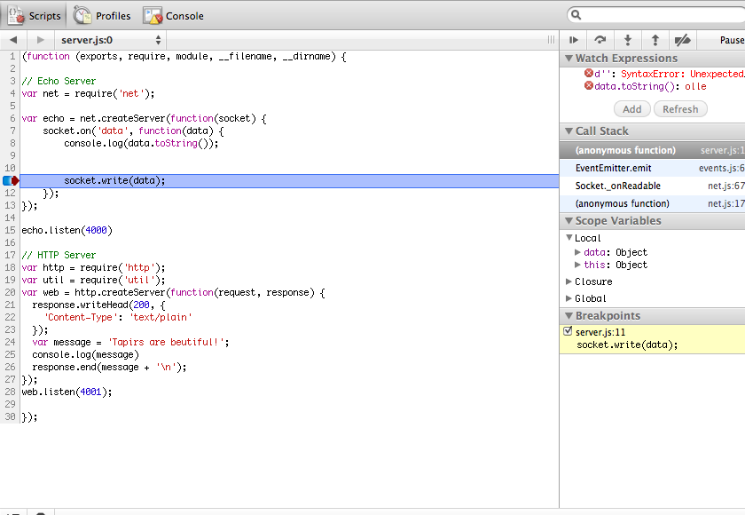

!SLIDE center
# Tools

!SLIDE commandline
# Reloaders

    $ npm install nodemon
    nodemon@0.3.2 ../node_modules/nodemon

    $ nodemon server.js 
    30 Apr 08:21:23 - [nodemon] running server.js 
    ...
    # Saving the file
    30 Apr 08:22:01 - [nodemon] restarting due to changes...
    
    # Alternative
    $ npm install supervisor
    $ supervisor server.js 
    DEBUG: Watching directory '/evented-programming-with-nodejs/. 

!SLIDE 
# Debugging

!SLIDE commandline
# node debug

    $ node debug server.js
    debug> run
    debugger listening on port 5858
    connecting...ok
    break in #<Socket> ./server.js:9
        debugger;

    debug> p data.toString();
    tapir

    // Javascript
    var echo = net.createServer(function(socket) {
      socket.on('data', function(data) {
          debugger; // <= break into debugger
          socket.write(data);
      });
    });

!SLIDE commandline
# node-inspector

    $ node-inspector &
    visit http://0.0.0.0:8080/debug?port=5858 to start debugging

    $ node --debug server.js
    debugger listening on port 5858

!SLIDE center
# node-inspector

 

